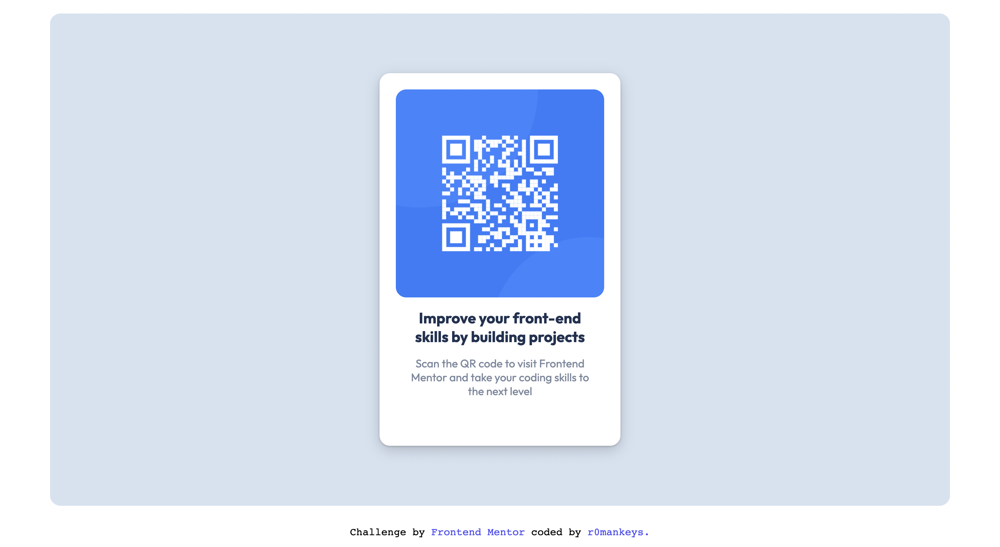

# Frontend Mentor - QR code component solution

This is my first GitHub repository, my first Frontend Mentor challenge (and actually my first time writing markdown)! In my opinion this challenge has really helped my problem solving and organizational skills and I'm very happy to share my experience with it!

This is a solution to the [QR code component challenge on Frontend Mentor](https://www.frontendmentor.io/challenges/qr-code-component-iux_sIO_H). 

## Table of contents 
- [Frontend Mentor - QR code component solution](#frontend-mentor---qr-code-component-solution)
  - [Table of contents](#table-of-contents)
  - [Overview](#overview)
    - [Screenshots](#screenshots)
    - [Links](#links)
  - [My Process](#my-process)
    - [Built with](#built-with)
    - [What I learned](#what-i-learned)
        - [CSS Custom Properties](#css-custom-properties)
        - [CSS Shadows](#css-shadows)
    - [Continued Development](#continued-development)
    - [Useful Resources](#useful-resources)
    - [Author](#author)
 
---

## Overview 
### Screenshots
|   |
|:--:|
| This is a desktop view of the website | 

|  |
|:--:|
| This is an iPhone SE (phone) view of the website |

### Links 

- Solution URL: [Add solution URL here](https://solution-URL.com)
- Live Site URL: [Add live site URL here](https://live-site-URL.com)

---

## My Process

### Built with 
- HTML 5
- CSS

### What I learned

This challenge wasn't so much difficult as it was intimidating since I had never completed a Frontend Mentor challenge and never made a public project (let alone any project). The most challenging part of this entire project to me was not the acutal programming of the page, but rather setting up GitHub and trying to understand what a repository even was. In spite of that being the main challenge however I did definitley learn things while programming this website.

##### CSS Custom Properties

This isn't something I necessarily learned, more so consolidated and finally put into action! By using a type selector you can make ==Custom CSS Properties== that can be used anywhere in your CSS file.

The syntax is as follows:

```css
element {
    --main-bg-color: red;
}
```

As you can see this makes code very readable, it provides a space within the code where you can 'redefine' CSS so that it makes sense to you and use it wherever you want in your code, **REPEATEDLY!**

```css
.class {
    background-color: var(--main-bg-color);
} 
```

Using Custom CSS Properties makes it very easy to refactor code (especially when your CSS file(s) is/are massive) because if you need to change a colour that occurs in multiple places on your page(s) you can simply change the value of the Custom CSS Property.

> **NOTE:** *The element that the Custom CSS Property is containing will define the scope of the CSS Property.*

SCOPE 
: The area of a program where an item that has an identifier name is recognized.


*For example:*

```HTML
<body>
    Text in body
    <main>
        Text in main
        <section>
            Text in section
        </section>
    </main>
</body>

<!-- This code demonstrates text in different scope -->
```
For the above code if you were to write corresponding CSS that looks like this: 

```css
 section {
    --small-text: 2rem;
 }
```
You would then not be able to write code that looks like this: 

```css
body {
    font-size: var(--small-text);
}

/* This code would not be executed because the Custom CSS Property is outside the scope of the body element */
```
Since the section is within the body and the Custom CSS Property was defined within the section element, it is restriced to that scope.

For this reason I prefer to put all of the Custom CSS Properties I need in a `:root` element at the beginning of my CSS file, I do this because it's easialy accessed at the top (makes it easy to refer to if I want to make changes) and the `:root` element makes it so that the scope of the properties is the entire document.

```css
:root {
    --main-bg-color: red;
    --main-accent-color: green;
    --font-lg: 2.5rem;
    --font-md: 1.5rem;
    --font-sm: 0.5rem;
    --max-width: 1440px; 
    --max-height: 800px;
} 
```

##### CSS Shadows 

CSS Shadows is still something I am trying to master but they can really make things pop on your page so I wanted to give it a try. 

Shadows are applied through 5 main steps: 

1. Horizontal Shadow 
2. Vertical Shadow 
3. Blur Effect 
4. Spread Radius 
5. Color
   
> **Note:** *After the horizontal and vertical shadows you can apply a color if you dont care about the other steps* .
> 

```css
element {
    box-shadow: 10px 5px orange;
}

/* OR */

second-element {
    box-shadow: 10px 5px 2px 6px orange;
}
```


### Continued Development

I plan to continue attempting Frontend Mentor challenges while consoidating my knowledge of HTML and CSS, I am currently learning Javascript and look foward to using it in future Frontend Mentor challenges and future original projects.

Particullarly excited to learn certain Javascript frameworks, namely: Next.js, Vue.js and React.

### Useful Resources 

- [W3schools.com](https://w3schools.com) - This resource really helped me when I was stuck on [CSS Shadows](https://www.w3schools.com/css/css3_shadows_box.asp).

- [MDN Web Docs](https://developer.mozilla.org/en-US/) - This is my go-to whenever I feel stuck, its where I consolidated my knowledge on Custom CSS Propeties and even learned more about them, its very user friendly and I highly recommned checking it out if you dont know about it already

---
### Author

- Frontend Mentor - [r0mankeys](https://www.frontendmentor.io/profile/r0mankeys) 